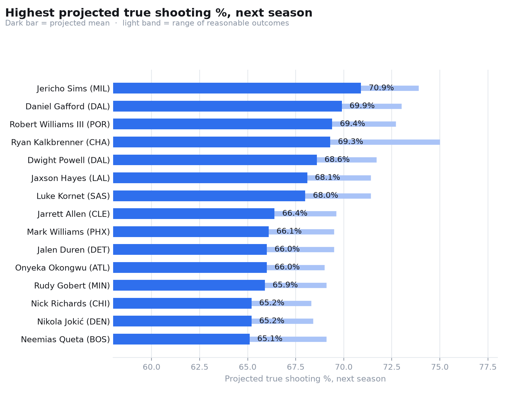

# Who's Set Up to Shoot the Best Next Season

*A look at what five years of NBA shooting data says about who's next*

Every player has a track record. Some are long and steady, some are short and shaky, and a few barely exist yet. The question here is simple: given what a player has actually done, how efficient should we expect them to be next season?

We built a model on five seasons of real NBA box scores (2021-22 through 2025-26) that does exactly that, for true shooting percentage — the version of shooting percentage that actually counts for something, since it folds in three-pointers and free throws instead of just counting makes and misses at the rim.

## What the model actually looks at

Three things, in roughly this order of importance: a player's own recent shooting efficiency, their age, and how big a role they played on offense. The model doesn't just average the last three seasons — it lets the data decide how much weight last season deserves versus two or three years back, and it does the same for age, since efficiency tends to climb through a player's twenties before it eventually declines.

The part that changed most from earlier versions of this project: it used to require three full consecutive seasons of history before it would touch a player at all, which meant anyone in their first couple of years, or coming off an injury gap, got skipped entirely. That's fixed now. A guy with one season on record gets a projection built from that one season, his age, and his role — a guy with three gets the full picture. Less history just means a wider, more honest range around the guess.

> It also isn't a guess dressed up as a fact. Every projection comes with a range, not just a single number — because "we're pretty sure" and "we have no idea" both deserve to look different on the page.

## The top of the list

Sorted by projected true shooting percentage for next season, here are the fifteen players the model is highest on:

| Rank | Player | Team | Projected TS% | Range |
|---|---|---|---|---|
| 1 | Jericho Sims | MIL | 70.9% | 67.8–73.9% |
| 2 | Daniel Gafford | DAL | 69.9% | 66.8–73.0% |
| 3 | Robert Williams III | POR | 69.4% | 65.9–72.7% |
| 4 | Ryan Kalkbrenner | CHA | 69.3% | 63.6–75.0% |
| 5 | Dwight Powell | DAL | 68.6% | 65.5–71.7% |
| 6 | Jaxson Hayes | LAL | 68.1% | 65.0–71.4% |
| 7 | Luke Kornet | SAS | 68.0% | 64.5–71.4% |
| 8 | Jarrett Allen | CLE | 66.4% | 63.6–69.6% |
| 9 | Mark Williams | PHX | 66.1% | 62.7–69.5% |
| 10 | Jalen Duren | DET | 66.0% | 62.7–69.5% |
| 11 | Onyeka Okongwu | ATL | 66.0% | 62.9–69.0% |
| 12 | Rudy Gobert | MIN | 65.9% | 62.9–69.1% |
| 13 | Nick Richards | CHI | 65.2% | 62.0–68.3% |
| 14 | Nikola Jokić | DEN | 65.2% | 62.4–68.4% |
| 15 | Neemias Queta | BOS | 65.1% | 61.4–69.1% |

*Source: real 2021–26 box score data. Full sortable, searchable version in `bayesian_ar_output/dashboard.html`.*

## Why it's mostly centers

If you don't follow basketball closely, this list might look strange — where's the league's leading scorer? Where are the guys who win MVP votes? The answer is that true shooting percentage rewards a very specific kind of efficiency, and the players who post the highest numbers are almost always low-usage bigs who mostly dunk, catch lobs, and clean up putbacks at the rim. They take fewer shots than a star wing or point guard, but the shots they do take go in at an extremely high rate. Nikola Jokić shows up here too, which is the exception that proves the rule — he's both a superstar and one of the most efficient scorers alive, at any usage level.

None of this is a flaw in the model. It's just what the stat measures. A star who creates his own shot off the dribble against a set defense is doing something much harder than a center scoring off a well-timed lob, and true shooting percentage doesn't try to tell them apart — it only counts how often the shots go in, relative to how many points each one was worth.

## What this doesn't know

The model assumes a player's role next season looks like his role last season. If a team is about to hand someone the ball twenty more times a game — or bench him in favor of a rookie — the projection won't see that coming, because nothing in the data yet reflects it. It's a reasonable starting assumption, not a roster prediction.

It also can't project a player with zero NBA track record. A complete rookie who hasn't played a qualifying season yet just isn't in this list — there's nothing to build a projection from until he's actually stepped on an NBA court.

## Where to look further

The full list — every player who qualified, not just the top fifteen — lives in an interactive page you can sort by team, by age, or by projected percentage, and search by name. That's the place to check where your own team's roster lands, not just the leaguewide leaderboard above.

---

*Built from Bayesian statistical models fit to real NBA data, not a fixed formula — every number above comes with real uncertainty attached, which is exactly what the ranges represent. See [`docs/TECHNICAL.md`](TECHNICAL.md) for the full modeling detail: priors, diagnostics, and what didn't work as cleanly as we'd like.*
